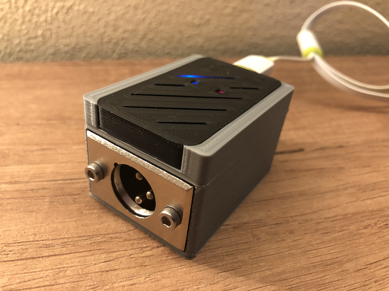

# ESP32-DMX-WiFi

Strongly based on amazing [LXDMXWiFi_Library](https://github.com/claudeheintz/LXDMXWiFi_Library) example [ESP32-DMX_rdm](https://github.com/claudeheintz/LXDMXWiFi_Library/tree/master/examples/ESP32-DMX_rdm).



Configuration utility for macOS and Windows is [here](https://github.com/claudeheintz/LXDMXWiFi_Library/tree/master/examples/configuration%20utility)

Changes from original source are:
```
#define STARTUP_MODE_PIN       0    // use onboard built-in button for force default setup
#define DIRECTION_PIN          4    // pin for output direction enable on RS-485 transceiver chip
#define DMXSERIAL_INPUT_PIN   16    // default UART2 RX pin
#define DMXSERIAL_OUTPUT_PIN  17    // default UART2 TX pin
#define STATUS_LED             2    // LED_BUILTIN for DOIT ESP32 DevKit V1

....

#define USE_REMOTE_CONFIG      0    // uncommented line for enable the configuration utility
```

## Bill of materials

- DOIT ESP32 DevKit V1 30 pins board
- RS-485 transceiver like SN75176 or MAX485 or equivalent
- Male XLR panel mount connector
- 1K Ohm 1/4 watt resistor
- 2K Ohm 1/4 watt resistor

## Schematic

```

RX2/GPIO16  ---+
               |                       
          2k   |   1k    +---------------+
GND  ---/\/\/\-+-/\/\/\--| R         VCC |---------- +5V (VIN when ESP32 board is powered by USB)
                         |               |
                    +----| RE/         B |---------- Data - (XLR pin 2)
                    |    |    SN75176    |
GPIO04      --------+----| DE          A |---------- Data + (XLR pin 3)
                         |               |
TX2/GPIO17  -------------| D         GND |---+------ Ground (XLR pin 1)
                         +---------------+   |
                                             |
                                            GND
```

## Images


